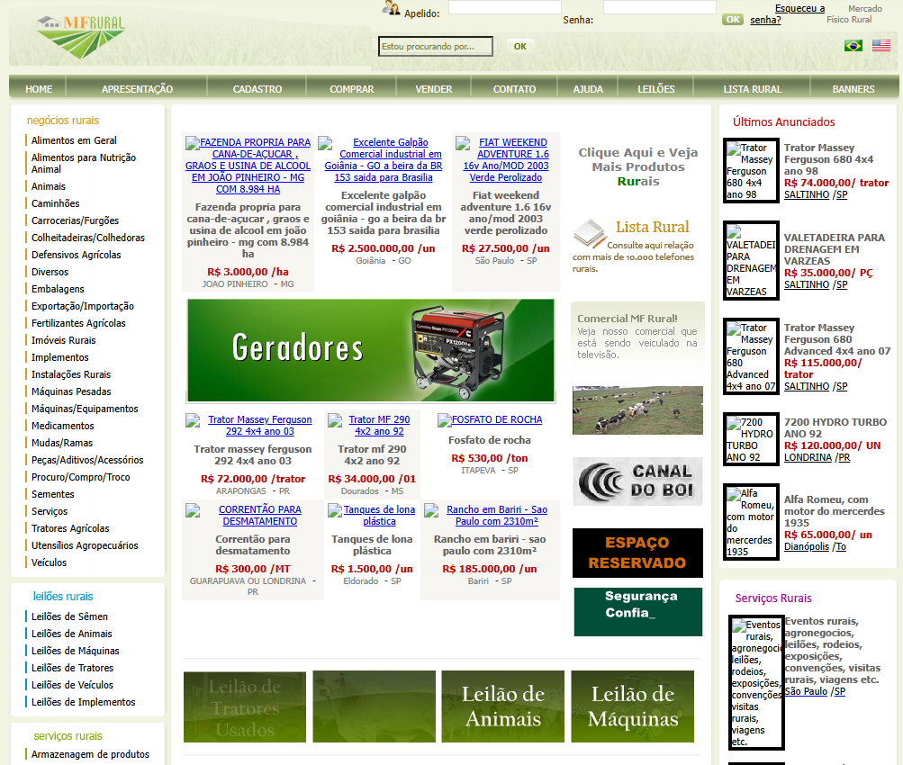
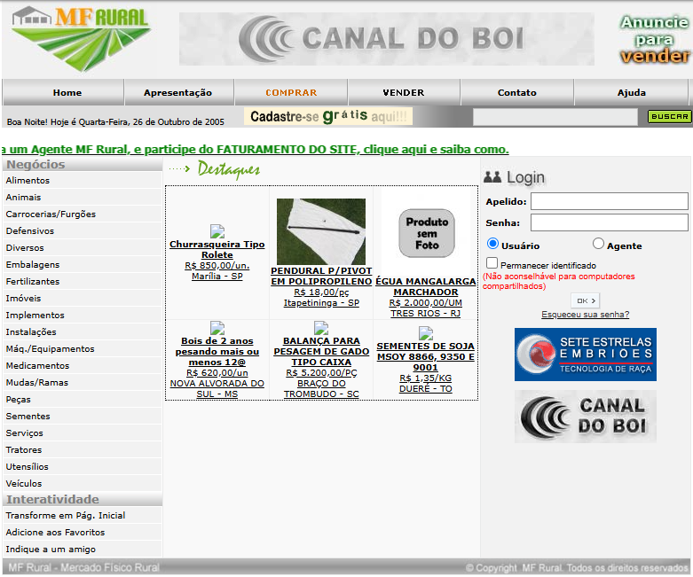
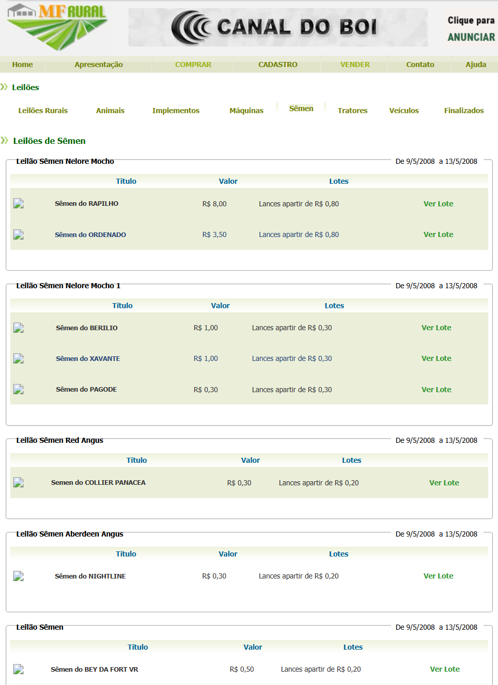
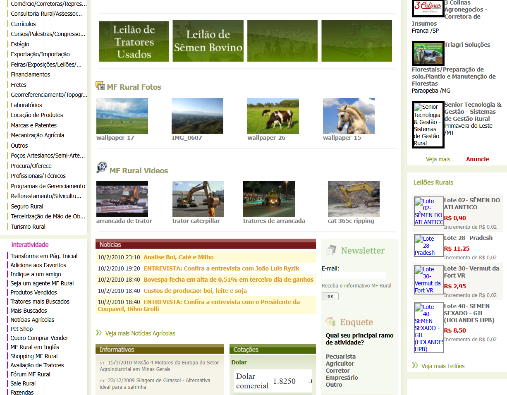

+++
title = "MF Rural: The Biggest Brazilian Rural E-commerce"
date = 2026-06-05T10:00:00-03:00
description = "A technical case study about building and scaling MF Rural, from classic ASP and SQL Server to modern .NET architecture."
draft = false
slug = "mf-rural-biggest-brazilian-rural-ecommerce"
tags = ["Case Study", "Software Architecture"]
categories = ["Software Architecture", "Backend"]
author = "Eduardo Potumati"
[cover]
    image = "cover.jpg"
    alt = "Historical screenshot of the MF Rural platform homepage"
    caption = "The evolution of MF Rural from classic ASP to modern .NET"
    relative = true
+++

# MF Rural - The biggest brazilian rural e-commerce

It started in early **2005**, I was just **18** and I already was deeply immersed in IT work and rural fields.

At that time, I had already launched some professional websites to **Canal do Boi** (a rural national TV channel) and to some auction companies in Brazil.

So I received a visit from some guys from another state (São Paulo), who wanted to create a new way to make business in the rural field.

In fact, the concept already existed in other markets, such as eBay in the United States, but it wasn’t even imagined to use that for rural commerce. It sounded delusional to many people.. not to us.

MF Rural helped connect buyers and sellers across a geographically dispersed agricultural market, reducing dependence on traditional in-person transactions and expanding commercial reach for rural businesses. 

> Over the following years, the platform would grow to tens of thousands of users and become one of the largest rural marketplaces in Brazil.

*MF Rural's origin story, including the early involvement of our development team, has been documented both by the [company itself](https://blog.mfrural.com.br/mf-rural-como-nasceu-o-mais-completo-portal-do-agronegocio-do-brasil/) and covered by [Brazilian press](https://tudodoms.com.br/m/noticia/137701/pauta---agromkt-summit--em-goiania-go--destaca-historia-por-tras-do-unico-ecossistema-digital-do-agronegocio) at the AgroMKT Summit in Goiânia.*

Our first stack was `ASP`+`SQL Server` and lots of `HTML` tables.
ASP.NET 2.0 had just been released.

> I was at the center of all technical decisions and execution.  Back in 2005, the industry simply called us "webmasters".

But in practice, I was the sole developer, database administrator, and infrastructure engineer. There were no specialized DevOps or frontend teams.

I built and sustained the entire architecture from the ground up. The website consisted of showing hundreds of rural products to users.
The interactivity was innovative, with a short and safe sign-in form, users could buy directly from sellers, and under MF Rural monitor.

The market response exceeded our expectations. New user registrations grew from **787** in **2005** to **3,434** in **2006** and then to **13,446** in **2007**, representing **more than 17 times** growth in just two years. 

To put this into perspective, it’s a platform focused on rural brazilian market, and this market wasn’t known as a technological place, so that growth was really surprising, and showed us how our software was on the right track.

> In those early days, our primary metric wasn't conversion rate optimization. It was raw viability and survival.

We were bringing a traditional, offline market into the digital age during a time when broadband was scarce. The success of technical decisions, like migrating from `LIKE` queries to `Full-Text Search`, wasn't measured in granular business KPIs, but in the fact that the database didn't lock up during peak access, allowing the user base to keep growing without requiring massive, immediate hardware investments. 

But, as we say in Brazil: life isn’t a strawberry.
Or, to use a more familiar English expression, not everything was sunshine and rainbows.

With the rapid growth, new demands and challenges came, and soon we thought we had to migrate to a dedicated server, and I was responsible (again) to configure all needed services.

There wasn’t enough information on the internet. I had to deal with:

- Remote access
- Database services
- DNS
- Firewall configuration
- `IIS`
- Backups

We faced two kinds of challenges:

- First, technically, we delivered a product to some hundreds of people at a time when broadband internet adoption was still limited .
- Second: make it easy for non technological people, with no UX information, or even studies.

It wasn’t easy, but it was amazing to make me highly adaptable and gave me a deep, cross-functional understanding of web architecture. Created a great base to my evolution.

And website evolution, the market demanded it, services were different from products, users demanded different ways to deal with technology… the work was constant, it wasn’t rare we work after **9 pm**.

HTTP wasn’t even enough. 

> Configuring SSL on IIS 6 felt like an adventure on its own.

At this time, security was becoming a real concern. I had to deal with `SQL injection` before it became a mainstream concern among web developers. Even then, I had taken precautions, data protection, daily backups, and parameterized queries.

And as the platform grew, we started receiving `SQL injection` attempts, although the attacks exposed weaknesses common in web applications of that era, it reinforced the importance of secure coding practices. From that point forward, I strengthened input validation, query parameterization, and database access controls throughout the platform. 

## In parallel, I developed the MF Leilões embryo.

Using `ASP.NET`, with auctions the challenge was real-time interaction.
And `.NET` offered `Project Atlas`, an `AJAX` extension.

I had used `XMLHttpRequest`, and `Atlas` was gold, considerably less lines to asynchronous communication. Using `ScriptManager` and `UpdatePanel` we could deliver the bid response to users.

By adopting asynchronous page updates through `Project Atlas`, we reduced the amount of data transferred during auction interactions and improved responsiveness for users participating in live bidding events. 

A few years later, it became part of `.NET Framework 3.5`.
In the next posts I’ll talk more about it, because of the auction platform (turned into a new company, MF Leilões).

## Scaling Search and Database Performance

So, some years after, it already was time to evolve.
In **2008** the `ASP.NET` version was launched.
And new challenges came.

Our team has grown too, we were **two**.

Searching products using `LIKE` queries on the database didn’t really return what the user wanted.
At this point, I need to study databases, mainly `SQL Server`, deeply.

Bigger amounts of data demanded best indexes, my first hands on with clustered and non-clustered, before that uniques had been enough.
I redesigned the indexing strategy for the platform's product catalog, improving query performance as the user base and listing volume continued to grow. 

And we started trying `Full-Text Search`.
Response times decreased, and the results were more precise.

Some users were so used to the old way, they knew how to search, to use key words.
The solution was creating a mixed search engine, where users could decide how to search.

It helped a lot, made users happy.
But as time passed, users saw how better the new way was, and the `LIKE` queries were forgotten.
After the migration, searches that previously struggled with larger datasets became noticeably faster and more accurate. 

## Moving to the Cloud

Around **2010** I drove the team (we were **3** now) to start testing and using Cloud.

Infrastructure management is increasingly complex. To gain flexibility and scalability we started using `EC2`, from `AWS`, one of our first experiences with cloud computing.

Obviously, nothing about “serverless” as we know nowadays.
In many ways, it was like a usual dedicated server.

But you could, with 2 clicks, change all instance, it sounded like a dream.
And it was useful.

Different from many developers, infra guys, or devops, my approach was always to optimize software and database performance before increasing hardware resources. In many cases, query optimization, indexing strategies, and code improvements delivered better results than simply scaling infrastructure. 

Before upgrading an `EC2` instance, we first reviewed execution plans, indexing strategies, and application bottlenecks. 
But the consistent growth demanded more resources, and `AWS` provided us with it.

## Building a Video Processing Pipeline

Then, another demand arose (one that would follow me throughout my career): handling video on the web. 
We needed to show videos in an era that there were many devices, each one with its own format or codec.

At that time, `FFmpeg` was the most practical solution available for handling video transcoding. 

Today this might seem straightforward, but at the time web video was fragmented across multiple formats, codecs, browsers, and devices. Even on MF Rural, nowadays we are using `AWS Elemental MediaConvert`.

To address this, I designed a transcoding workflow based on `FFmpeg`. An `ASP.NET` application orchestrated the conversion process, launching `FFmpeg` jobs and tracking their execution status. 

Main challenges:

- Security
- Job monitoring and execution tracking
- CPU exhaustion caused by video transcoding

The solution proved successful. By **2015**, more than **5,000** product listings included videos processed through the platform. The transcoding workflow remained in use for years and processed thousands of videos before being replaced by a managed cloud solution. 

But I didn’t see that.
Around **2013**–**2014**, the company reached a stage where it required a full-time local team. I had others projects in parallel, and it wasn’t worth it.

And I eventually left the project, but I’ve never lost contact, sometimes working as a consultant or a freelancer, and working directly with the brother-company, MF Leilões.

## Coming Back
### Ten Years Later...

...I received a call from the current MF Rural CEO, inviting me to contribute as a consultant on the next generation of the platform, now built with `.NET 10` and `Next.js`.

After evaluating the project's scope and complexity, it became clear that a consulting role would not be enough. The platform had grown significantly, and many of the challenges required deep involvement in architecture, business rules, and technical decision-making.

We agreed that the best path forward was for me to rejoin the team full-time.

By then I was living roughly **700 kilometers** away, so returning was not as simple as it had been in **2005**.  We eventually found a model that works well: three weeks working remotely and one week on-site each month. Given the company's predominantly on-site operation, finding a workable balance between distance and collaboration was essential.

---

## Further Reading

- [How MF Rural was born - official company history](https://blog.mfrural.com.br/mf-rural-como-nasceu-o-mais-completo-portal-do-agronegocio-do-brasil/) *(Portuguese)*
- [AgroMKT Summit coverage - Brazilian press](https://tudodoms.com.br/m/noticia/137701/pauta---agromkt-summit--em-goiania-go--destaca-historia-por-tras-do-unico-ecossistema-digital-do-agronegocio) *(Portuguese)*