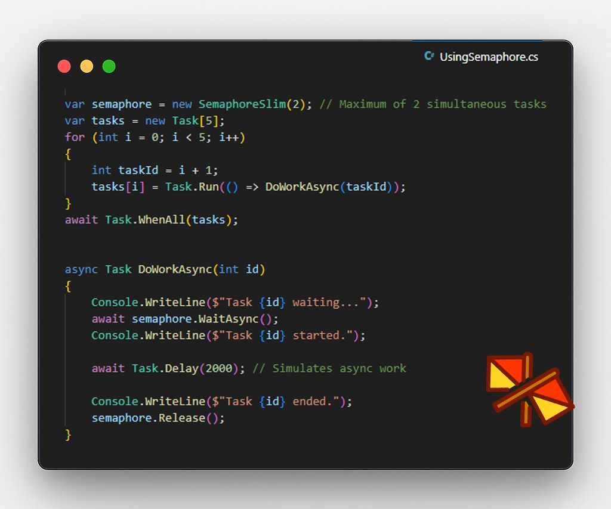

+++
title = "Concurrency Control in C#: Semaphore and SemaphoreSlim"
date = 2025-08-13T10:00:00-03:00
description = "A technical deep dive into resource management and thread synchronization within the .NET ecosystem."
draft = false
tags = ["csharp", "dotnet", "Concurrency", "Performance", "Software Architecture", "Full Article"]
categories = ["Backend", "Architecture"]
author = "Eduardo Potumati"
canonicalURL = "https://blog.balta.io/controle-de-concorrencia-em-csharp-semaphore-e-semaphoreslim/"
[cover]
    image = "cover.jpg"
    alt = "Semaphore and SemaphoreSlim"
    caption = "A comparative analysis of memory footprint and startup latency across Standard Runtime, Trimmed Runtime, and Native AOT."
    relative = true
+++

I recently published a detailed technical article on **Balta.io**—one of the premier .NET ecosystem references in Brazil—addressing a critical topic for high-performance systems: **concurrency control**.

As software engineers with extensive experience in high-demand solutions, we often face the challenge of "doing as much as possible, as fast as possible". However, infrastructure realities—such as rate limits in third-party APIs or hardware constraints—force us to understand exactly **when and how to throttle** our execution.

### Why read this article?

In modern system development—particularly in **Streaming** scenarios and massive data processing where I have spent over 20 years of my career—the naive use of `Task.WhenAll` can lead to resource exhaustion or being blocked by external services.

In this guide, I explore:

* **SemaphoreSlim:** The ideal choice for modern applications, optimized for `async/await` with low memory overhead.
* **Semaphore (Legacy/Global):** When you truly need to step outside your application's scope and control concurrency at the Operating System level (**cross-process**).

### Technical Highlight: The "Real-World" Scenario

In the article, I use a practical analogy derived from common architectural challenges: controlling requests to a weather API and orchestrating heavy **video transcoding** processes.

> **Key Takeaway:** While `SemaphoreSlim` acts as an efficient traffic guard within your code, the classic `Semaphore` is capable of coordinating traffic between different "cities" (processes) on your server.

### Read the full article on Balta.io

To check out the complete code examples, `try/finally` implementations with `Release()`, and the nuances between named and local semaphores, access the original link (in Portuguese):

👉 <a href="https://blog.balta.io/controle-de-concorrencia-em-csharp-semaphore-e-semaphoreslim/" target="_blank" rel="noopener">**Concurrency Control in C#: Semaphore and SemaphoreSlim - Balta.io**</a>

---