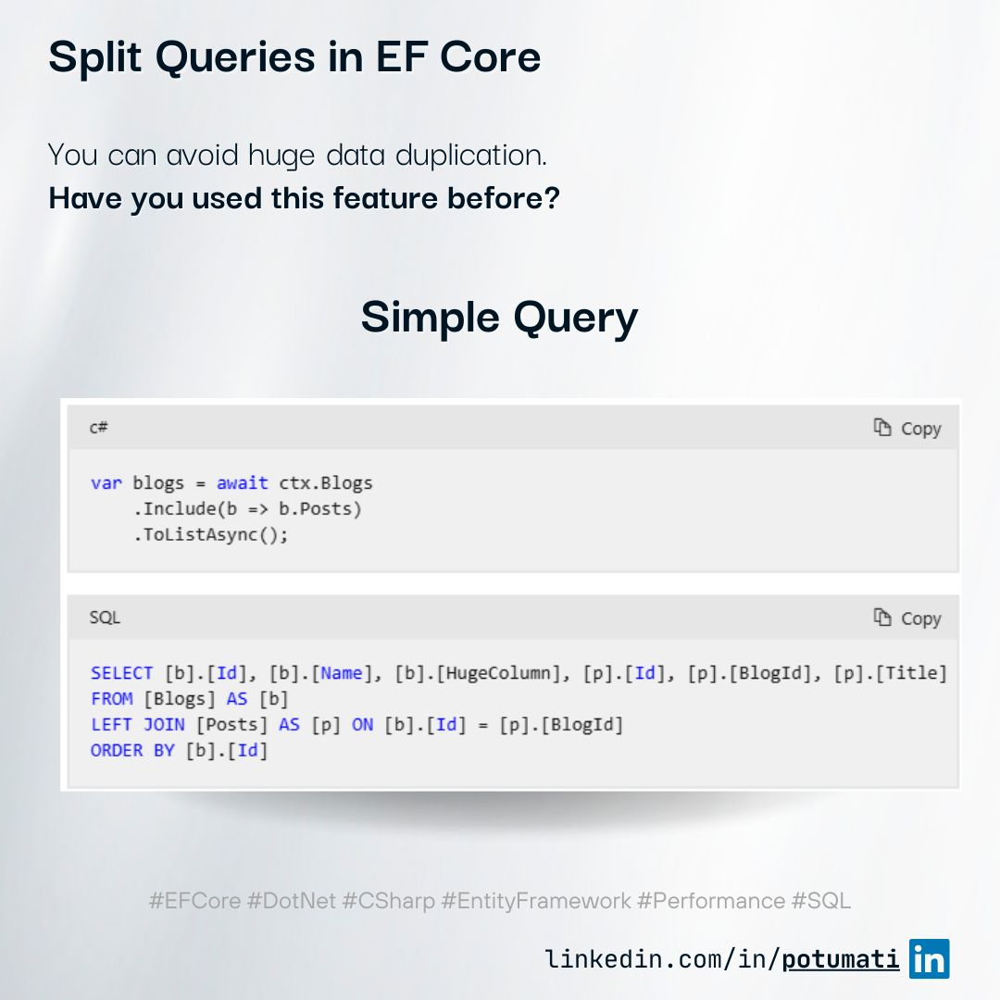

+++
title = "Split Queries in EF Core: Mitigating Cartesian Explosion"
date = 2025-02-15T10:00:00-03:00
description = "A look into how Split Queries in Entity Framework Core can help solve performance issues by preventing data duplication."
draft = false
tags = ["EF Core", "dotnet", "csharp", "Entity Framework", "Performance", "SQL", "LinkedIn Post"]
categories = ["Backend", "Performance", "Database"]
author = "Eduardo Potumati"
[cover]
    image = "cover.jpg"
    alt = "A visualization illustrating how Split Queries solve Cartesian Explosion in EF Core"
    caption = "Mitigating extensive duplicated data loads using EF Core Split Queries"
    relative = true
+++

**Have you worked with Split Queries in EF Core before?**

When you incorporate related tables using EF Core, it typically generates a `JOIN` query, potentially leading to duplicated data. While this duplication is usually insignificant for small datasets, it can become problematic when dealing with larger volumes.

In scenarios like the example I mention (images), where `[Blogs].[Id]` and `[Blogs].[Name]` are repeated based on the number of Posts, a phenomenon known as **Cartesian Explosion** occurs, causing unexpected spikes in data loads.

The issue arises when the Blogs table contains extensive columns like binary data or lengthy text fields. In such cases, the duplicated data is transmitted to the client multiple times, intensifying memory and network consumption.

### To mitigate this, Split Queries come into play.

EF Core employs separate queries instead of a single `JOIN`, effectively curbing data redundancy.

However, this approach does introduce certain trade-offs:

* **Pros:** Mitigates extensive duplicated data.
* **Cons:** May lead to multiple database connections being opened and closed.

**Exercise Caution!**
While Split Queries can enhance performance under specific circumstances, they might elevate the number of database round trips. Therefore, it's advisable to implement them judiciously.

**Have you had experience with Split Queries in EF Core?**

---

👉 *Adapted from my original post on [LinkedIn](https://www.linkedin.com/posts/potumati_efcore-dotnet-csharp-activity-7295433994156843008-Yqjn?utm_source=social_share_send&utm_medium=member_desktop_web&rcm=ACoAAAGzxU4BM2J38YwZLdJjXXQDdoPvNE5m_d0).*
